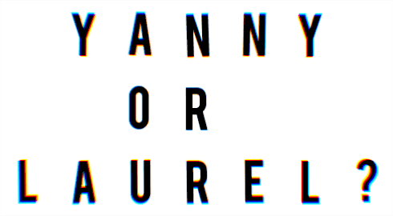

# Floating letters

A tool to create floating text looking like this:



Supports different fonts:


Available fonts for now are "Helvetica" and "BEBAS".
For "Helvetica" font, cyrrilic characters are available.
For "BEBAS", unfortunately, they do not.
Actually, any fond in ttf format may be used.
But first, it should be converted to images with "font_to_letters.py"

## Usage

Main script:

```txt
usage: draw.py [-h] [--font FONT] [--black_background] [--smart]
               [--grid_x GRID_X] [--grid_y GRID_Y] [--rgb_shift RGB_SHIFT]
               text output

positional arguments:
  text                  Text to draw
  output                Where to save

optional arguments:
  -h, --help            show this help message and exit
  --font FONT, -f FONT  Font to use.There must be png files like:
                        letters/{FONT_NAME}_{character}.png
  --black_background, -b
                        Make black background instead of white
  --smart, -s           Smart alignment of letters, then grid_x and y options
                        are cancelled. Recommended to use.
  --grid_x GRID_X, -x GRID_X
                        Width, letters
  --grid_y GRID_Y, -y GRID_Y
                        Height, letters
  --rgb_shift RGB_SHIFT, -r RGB_SHIFT
```

Script to convert ttf into a program-readable form:

```txt
./font_to_letters.py [ttf file] [output folder]
```
